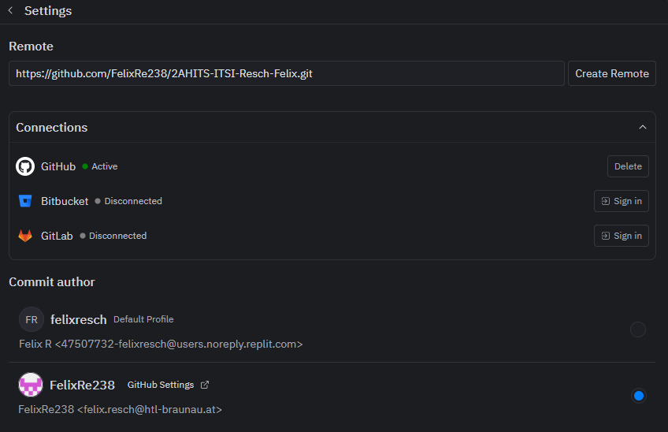
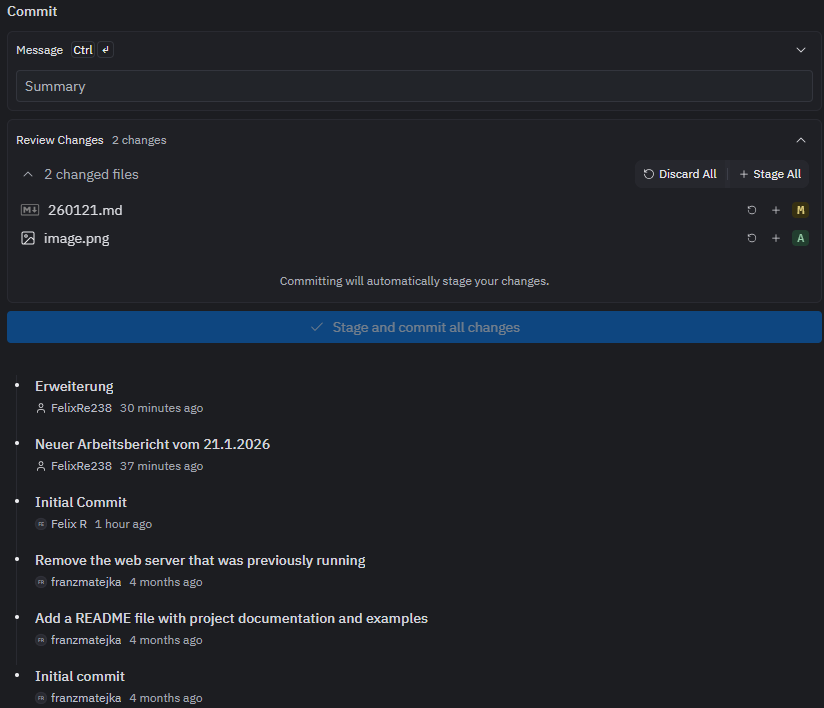

# Arbeitsbericht vom 21.01.2026

- Name: Felix Resch
- Klasse: 2AHITS
- Gruppe 2
- Fach: ITSI Übungen
- Thema: Github

- Zu Beginn erstellen wir einen Account auf Github
- Danach gehen wir zurück auf replit, öffnen einen neuen Tab und geben "Git" ein und öfnnen den Tab.
- Hier klicken wir oben rechts auf das zahnrad öffnen die Einstellungen, melden uns mit dem gerade erstellten Github Account an und geben den Github Link bei Remote ein.
- Bei Github stellen wir https ein.
- Wir gehen wiedr zurück zu Replit und 
- Hier schreiben wir einfach eine Message für das Comiten als summary und commiten die Änderungen
- Als nächstes gehen wir auf sync changes und gehen danach züruck auf Github
- Hier können wir unter actions anschauen wann unsere Änderungen Übernommen wurden und danach den Bericht als Link über Teams abgeben.